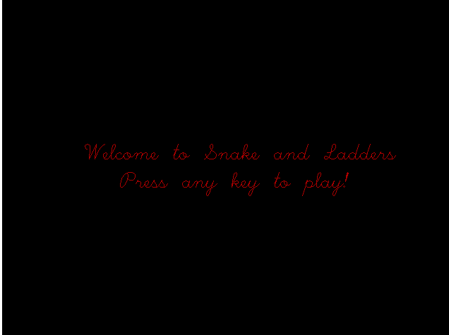
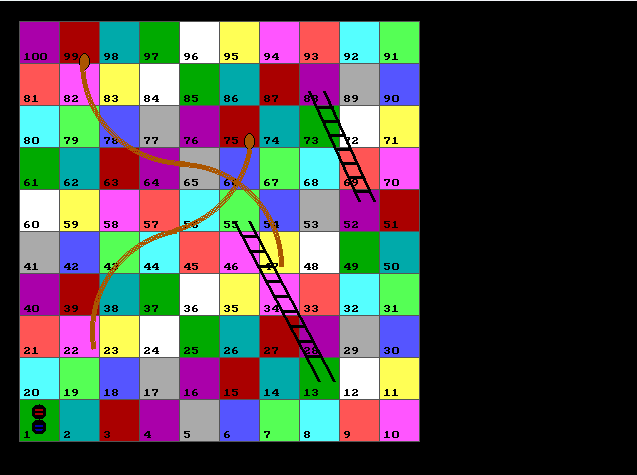
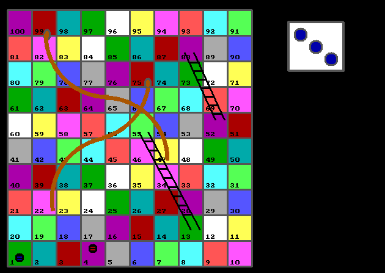
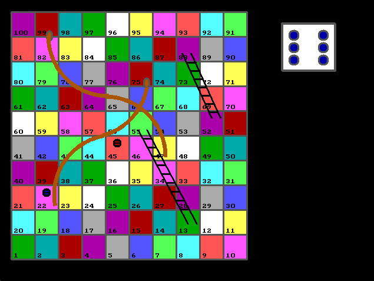
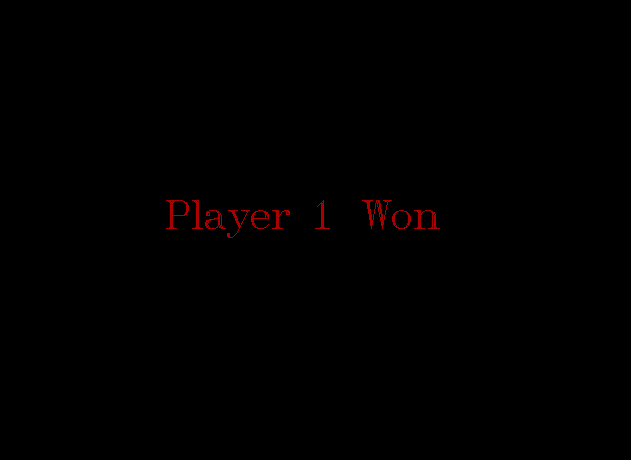

# 🎲 Snake and Ladders in C (graphics.h)


A simple Snake and Ladders game built in C using the **graphics.h (BGI)** library.  
Bring back nostalgic vibes of Turbo C++ with colors, dice rolls, snakes 🐍, ladders 🪜, and winning screens!  

---

## ✨ Features

- Two-player mode (Blue vs. Red)  
- Graphical dice roll  
- Snakes that pull you down  
- Ladders that lift you up  
- Winner announcement when a player reaches 100  
- Press **Esc** to quit anytime  

---

## 🛠 Requirements

- Compiler that supports **graphics.h** (Turbo C++, WinBGI)  
- BGI graphics driver/library

---

## ▶️ How to Run

1. Clone the repo:
   ```bash
   git clone https://github.com/AkshayGarg10/Snake-and-Ladders-C.git

2. Open the code (e.g. SNAKE_LADDER.CPP) in your graphics-capable C/C++ IDE.
3. Compile and run.
4. Use Enter to roll the dice.
5. Press Esc to exit at any time

 
 

 
 

